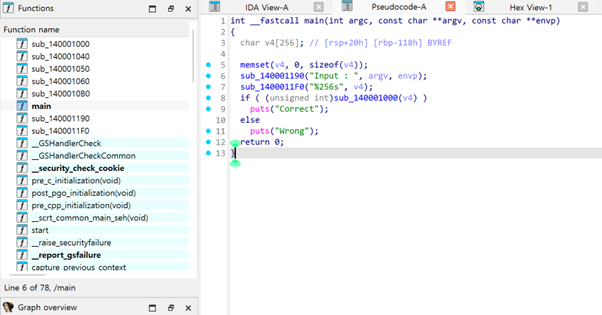
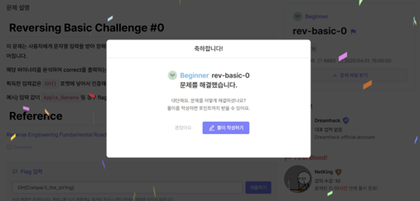

# Reversing Basic Challenge Write-up

## 1. 문제 설명

사용자에게 문자열 입력을 받아 정해진 방법으로 입력값을 검증하여 `Correct` 또는 `Wrong`을 출력하는 프로그램입니다.

해당 바이너리를 분석하여 `Correct`를 출력하는 입력값을 찾아야 합니다.

문제의 핵심이 되는 `main` 함수 코드는 아래와 같이 나왔습니다.

```c
int __fastcall main(int argc, const char **argv, const char **envp)
{
  char v4[256]; // [rsp+20h] [rbp-118h] BYREF

  memset(v4, 0, sizeof(v4));
  sub_140001190("Input : ", argv, envp);         // "Input : " 출력
  sub_1400011F0("%256s", v4);                    // 사용자에게 문자열 입력 받음
  if ( (unsigned int)sub_140001000(v4) )         //  핵심: 입력값을 검증하는 함수
    puts("Correct");                             // 검증 성공
  else
    puts("Wrong");                               // 검증 실패
  return 0;
}
```



## 2. 분석 과정

### `main` 함수 분석

1.  `v4`라는 256바이트 크기의 변수에 사용자 입력을 받습니다.
2.  `sub_140001000(v4)` 함수를 호출하여 입력값의 유효성을 검사합니다.
3.  `sub_140001000` 함수의 반환값이 **0이 아니면(참)** `"Correct"`를, **0이면(거짓)** `"Wrong"`을 출력합니다.

**목표**: `sub_140001000` 함수가 참(1)을 반환하게 만드는 입력값을 찾는 것입니다.

### `sub_140001000` 함수 분석 (핵심 로직) 

리버싱의 핵심은 바로 이 `sub_140001000` 함수의 동작을 파악하는 것입니다.

리버싱 도구(IDA)로 함수 내부를 분석하면 이 함수가 복잡한 암호화 로직이 아닌 **단순 문자열 비교** 로직을 수행한다는 것을 알 수 있습니다.

-   **동작 방식**: 함수는 사용자가 입력한 문자열과 프로그램 내부에 숨겨진(하드코딩된) 특정 문자열을 **직접 비교**합니다.
-   **핵심**: 이 **숨겨진 문자열**을 찾아내기만 하면 문제를 해결할 수 있습니다.


## 3. 해결 방법 🛠️

리버싱 도구를 사용하여 바이너리 파일의 데이터 섹션(data section)이나 `sub_140001000` 함수가 참조하는 문자열을 검색합니다.

검색 결과, 비교 대상으로 사용되는 문자열을 아래와 같이 찾을 수 있습니다.

`Compar3_the_str1ng`


## 4. 사진 첨부


---

# C언어 빌드 및 IDA 리버싱 기초 과제

C언어로 직접 간단한 프로그램을 만들고 이를 IDA 로 열어 원본 소스 코드와 IDA가 분석한 의사코드 및 어셈블리 코드를 비교하는 과정

## 1. C언어 코드 작성
먼저 숫자를 입력받아 특정 값과 비교하는 간단한 C 프로그램을 작성합니다.

```
#include <stdio.h>

int main() {
    int userInput; // 사용자의 입력을 저장할 변수

    printf("Enter the secret number: ");

    // 사용자로부터 정수 하나를 입력받습니다.
    scanf("%d", &userInput);

    // 입력받은 값이 1234와 같은지 비교합니다.
    if (userInput == 1234) {
        puts("Correct"); // 같다면 Correct 출력
    } else {
        puts("Wrong");   // 다르다면 Wrong 출력
    }

    return 0;
}
```

## 2. EXE 파일로 컴파일하기

작성한 C 코드를 실행 가능한 .exe 파일로 만듭니다.

### 방법 1: Visual Studio 사용

  1. Visual Studio에서 '콘솔 앱(Console App)' 프로젝트를 생성합니다.

  2. 기본 코드를 지우고 위에서 작성한 코드를 붙여넣습니다.

  3. 상단 메뉴에서 **Build > Build Solution**를 클릭하여 .exe 파일을 생성합니다.

## 3단계: IDA로 EXE 파일 분석하기
이제 컴파일된 compare.exe 파일을 IDA로 열어 분석합니다.

### 의사코드(Pseudo-code)와 비교
| 원본 C 코드 (`compare.c`) | IDA 의사코드 |
| :--- | :--- |
| `` `int userInput;` `` | `` `int v4;` `` |
| `` `printf("Enter the secret number: ");` `` | `` `sub_4010F0("Enter the secret number: ");` `` |
| `` `scanf("%d", &userInput);` `` | `` `scanf("%d", &v4);` `` |
| `` `if (userInput == 1224)` `` | `` `if ( v4 == 1224 )` `` |
| `` `puts("Correct");` `` | `` `puts("Correct");` `` |
| `` `else { puts("Wrong"); }` `` | `` `else { puts("Wrong"); }` `` |

### 분석 포인트

* userInput과 같은 변수 이름이 v4처럼 의미 없는 이름으로 변경되었습니다.
* printf와 같은 함수가 sub_주소값 형태의 내부 함수로 표현될 수 있습니다.
* 하지만 if (v4 == 1234) 와 같은 핵심 비교 로직과 **상수 1234**는 명확하게 남아있어 프로그램의 중요 동작을 파악할 수 있습니다.

## 4단계: 어셈블리 뷰 분석
if (userInput == 1234) 부분에 해당하는 코드는 다음과 같습니다.

```
; userInput 변수의 값을 eax 레지스터로 옮김
mov     eax, [ebp+userInput]

; eax의 값과 4D2h (16진수, 10진수로는 1234)를 비교
cmp     eax, 4D2h

; 비교 결과가 다르면(Not Zero) 특정 주소(loc_4010AA)로 점프
jnz     short loc_4010AA
```

### 주요 명령어
* mov: 데이터를 레지스터나 메모리로 **이동** 합니다.
* cmp: 두 값을 비교합니다. C언어의 == 연산자와 유사한 역할을 합니다.
* jnz (Jump if Not Zero): cmp의 결과가 '같지 않으면' 다른 코드로 **점프**합니다. C언어의 if-else 구문을 구현하는 핵심적인 명령어입니다.
